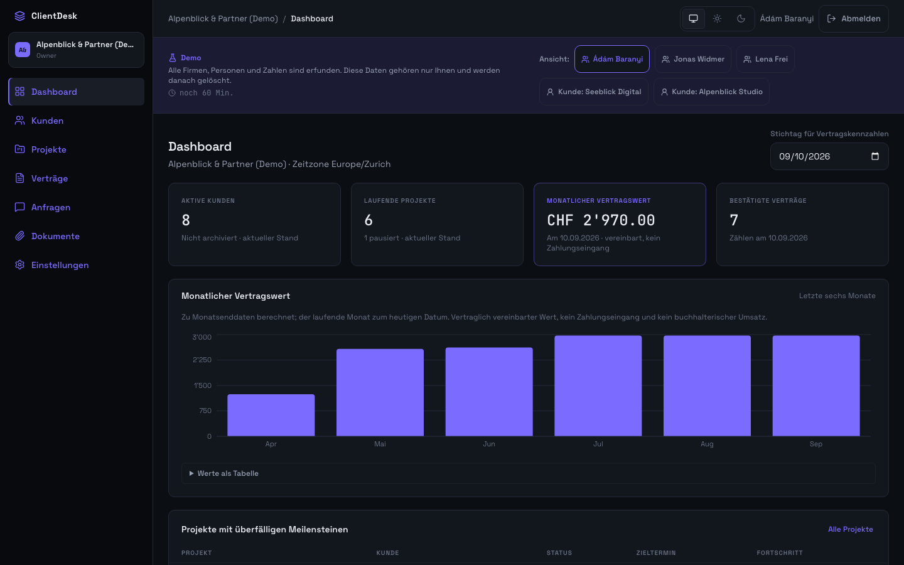
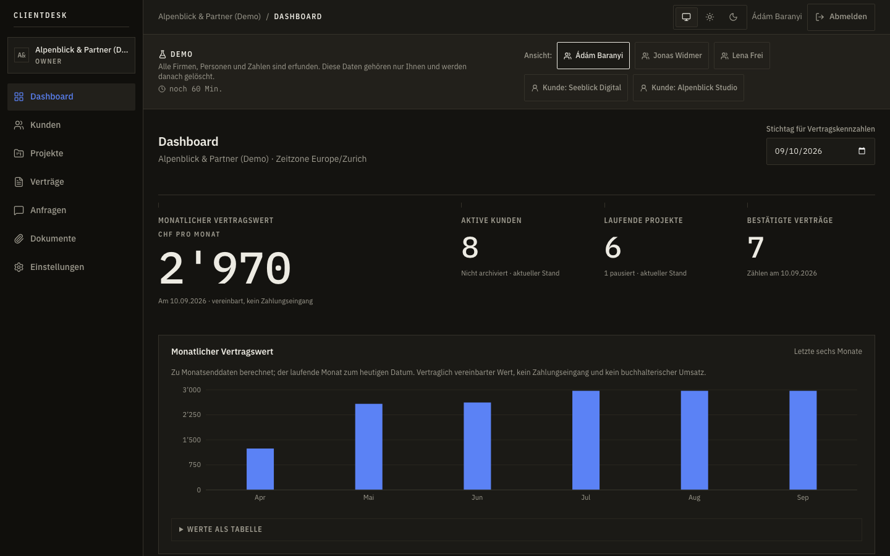

# Fallstudie

Tallyroom ist ein Portfolio-Projekt: ein SaaS-Dashboard mit Kundenportal für kleine
Digitalagenturen, gebaut zwischen dem 09. und dem 12.09.2026 und seit dem 11.09.2026 live unter
<https://tallyroom.adambaranyi.xyz>. Alle Firmen, Personen und Zahlen darin sind erfunden.

Diese Seite erklärt die Entscheidungen — jede aus einer Nutzeraufgabe, nicht aus Geschmack — und
nennt zu jeder den Beleg. Was gemessen wurde, steht mit Zahl da; was nicht gemessen ist, steht
nicht da.

## Die drei Aufgaben

1. **Das Team** will an einem Ort sehen, was mit einem Kunden läuft: Projekte, monatliche
   Serviceverträge, offene Anfragen, Unterlagen.
2. **Der Kunde** will sehen, was ihn betrifft — und nichts davon, was intern besprochen wird.
3. **Der Betreiber** will das Ganze vorführen können, ohne vorher Konten zu verteilen und ohne
   dass ein Besucher die Daten eines anderen sieht.

Alles Weitere folgt aus diesen drei Sätzen.

## Entscheidungen

### Ein getrenntes Portal statt einer gefilterten Oberfläche

Die naheliegende Lösung wäre eine Oberfläche, die je nach Rolle Felder ausblendet. Sie ist auch die
gefährlichste: Ausblenden ist eine Anzeigeentscheidung, und eine vergessene Stelle liefert interne
Daten an den Kunden aus.

Das Kundenportal hat deshalb eine eigene Datenzugriffsschicht, deren Abfragen fest auf Workspace
und Kunde eingeschränkt sind, und eigene DTOs, die interne Felder **gar nicht erst enthalten** —
ein öffentlicher Kommentar hat kein Sichtbarkeitsfeld, weil es nichts zu unterscheiden gibt.

_Beleg:_ 16 Integrationstests allein für diese Trennung, dazu eine rekursive Suche über jede
Portal-Antwort, die anschlägt, sobald eine interne Notiz irgendwo auftaucht. Fremde Objekte
antworten mit **404 statt 403**: ein 403 verrät, dass es das Objekt gibt.

### Freigeben ist eine Handlung

Dokumente sind intern, bis jemand sie freigibt. Kein Standard, der „meistens passt", keine
Sammelfreigabe beim Hochladen. Dasselbe bei Kommentaren: intern oder öffentlich, im Verlauf
sichtbar unterschieden.

_Beleg:_ Im Browser gegengeprüft — dieselbe Anfrage zeigt dem Team einen internen Kommentar, den
die Kundenansicht nicht kennt. Dateien sind ausschliesslich über die autorisierte API erreichbar:
privater Bucket, zufälliger Objektschlüssel, keine öffentliche URL, keine vorsignierten Links.

### Eine Demo je Besucher statt Screenshots

Ein Portfolio-Projekt, das man nur auf Bildern sieht, beweist nichts. „Demo starten" legt einen
eigenen Workspace an: vollständiger Datenbestand, fünf Identitäten zum Umschalten, 60 Minuten
Laufzeit, danach räumt ein Lauf Daten, Sitzungen und Dateien weg. Zwei Besucher sehen einander
nicht.

Grenzen gehören dazu: 30 Kunden, 50 Projekte, 50 Verträge, 100 Anfragen je Demo, fünf Demos je
Adresse und Viertelstunde, höchstens 50 gleichzeitig. Eigene Dateien nimmt die Demo nicht an; für
den Testupload liegt ein Beispieldokument bei.

_Beleg:_ Der Rollenwechsel erneuert die Sitzungs-ID und lädt die Oberfläche vollständig neu; Konten
fremder Demos werden abgewiesen. Einen Impersonation-Endpunkt für gewöhnliche Konten gibt es nicht.

### Eine Kennzahl, deren Regel ausgeschrieben ist

„Monatlicher Vertragswert" klingt eindeutig und ist es nicht. Die Regel steht deshalb im Klartext
in [ARCHITECTURE.md](ARCHITECTURE.md): Ein Vertrag zählt am Stichtag, wenn er bestätigt ist, sein
Beginn nicht in der Zukunft liegt und sein Ende leer oder später ist — das Enddatum ist exklusiv.
Sein Betrag ist die letzte Preisversion vor dem Stichtag. Eine Preisänderung gilt ab ihrem Datum
und lässt vergangene Monate unberührt.

_Beleg:_ Tests prüfen die **Zahl**, nicht die Form der Antwort. Ein Zähler, der überall null zeigte,
kam genau dadurch ans Licht (Diagnose 7).

### Gestaltung wie ein Datenblatt, nicht wie ein Kartenteppich

Richtung: Tinte auf Papier, Kanten statt Schatten, Zahlen in Mono, IBM Plex in drei Schnitten.
Kobalt ist **Datenfarbe** und an genau vier Stellen erlaubt — Diagrammdaten, aktiver
Navigationszustand, Fokusring und der Nebel im Hero der Startseite. Nie auf einem Knopf: die
Hauptaktion trägt Tinte. Ein Token namens `--accent` hätte genau dazu eingeladen, deshalb heisst es
`--data-mark`.

Der erste Entwurf war Violett auf Fastschwarz. Ein Audit gegen die verbreiteten Muster hat ihn als
das benannt, was er war: der KI-Standard in besserer Kleidung. Er ist ersetzt worden, nicht
verteidigt.

### Lesbarkeit schlägt Dichte

Das Datenblatt hatte ein Arbeitsband von 11 bis 14 px. Sauber gestuft — und für den Betreiber
schwer zu lesen, besonders in Kopf- und Fusszeile. Seit dem 12.09.2026 gilt: **keine Schrift unter
16 px**, auf keiner Seite und keiner Breite. Den Unterschied tragen jetzt Schnitt, Versalien,
Gewicht und Farbe.

Das ist eine Layoutänderung, keine Stiländerung, und sie hatte Folgen: Listen wechseln zwischen
Tabelle und Karten bei 1024 statt bei 640 Pixeln, weil die schmalste Tabelle 725 Pixel will und bei
768 nur 718 zur Verfügung stehen. Zwei Engine-Eigenheiten kamen dabei ans Licht (Diagnosen 24 und
25).

_Beleg:_ Zwei Prüfungen halten die Regel — `bun run check:font-floor` im Quelltext, in der CI, und
`e2e/font-size.spec.ts` im Browser: jede Seite, jeder Dialog, sechs Breiten, dazu „kein Wort mitten
im Wort gebrochen" und „jedes Formularfeld hat id oder name".

### Bewegung mit Budget

Drei Geschwindigkeiten (90, 160, 260 ms), zwei Kurven aus IBMs Bewegungssystem, genau drei bewegte
Momente. Kein Hochzählen von Zahlen, kein Scroll-Fade, kein Parallax. Der Nebel auf der Startseite
ist ein eigener Shader von 2.9 KB statt einer 155-KB-Bibliothek, läuft nur dort, hält bei
`prefers-reduced-motion` still und hat einen Knopf zum Anhalten (WCAG 2.2.2).

_Beleg:_ Lighthouse gegen die Live-Seite: Desktop 100 in allen vier Kategorien, mobil 99 in drei von
vier Läufen. Die Startseite lädt 135.7 KB JavaScript (gzip) gegen ein Budget von 142 KB, das die CI
prüft; Teamansicht, Portal und Rechtsseiten kommen erst beim Aufruf dazu.

### Sicherheit als Voreinstellung, nicht als Kapitel

Serverseitige Sitzungen statt Tokens — eine Abmeldung wirkt sofort und serverseitig. Argon2id,
Sitzungsrotation bei Anmeldung und Rollenwechsel, CSRF mit sitzungsgebundenem Token und
Herkunftsprüfung, Rate-Limit auf der Anmeldung. Content Security Policy ohne `unsafe-inline`; die
Produktionsprüfung scheitert bei jedem Verstoss und bei jedem Konsolenfehler.

_Beleg:_ Die Null ist gegengeprüft: ein absichtlich eingeschleustes Inline-Skript, ein Inline-Style
und ein fremdes Bild wurden alle drei erkannt. Einzelheiten in [SECURITY.md](SECURITY.md).

### Betrieb gehört dazu

Der Deploy wird von Hand ausgelöst — eine grüne Pipeline deployt nichts. Das Skript sichert die
Datenbank **vor** der Migration, weil Migrationen nur vorwärts laufen. Jede Nacht um 02:30 sichert
ein Timer Datenbank und Dokumente mit Prüfsumme je Objekt.

_Beleg:_ Die Probe-Wiederherstellung ist auf dem Server tatsächlich gelaufen: 16 Tabellen mit
denselben Zeilenzahlen, 18 aktive Dokumente mit Datei, 18 Objekte Prüfsumme für Prüfsumme gleich.
Die Gegenprobe mit einem entfernten Dokument scheitert wie gewollt. Eine Sicherung, die nie
zurückgespielt wurde, ist eine Hoffnung.

## Was geprüft ist

| Prüfung                                | Ergebnis                                             |
| -------------------------------------- | ---------------------------------------------------- |
| Unit- und Integrationstests            | 214 grün, gegen eine echte PostgreSQL                |
| Playwright über sechs Breiten          | 292 grün, samt axe in hell und dunkel, vier Sprachen |
| WebKit und Firefox, iPhone bis Desktop | 296 grün                                             |
| Produktionsprüfung gegen den Server    | 3 von 3, null CSP-Verstösse, null Konsolenfehler     |
| Lighthouse live                        | Desktop 4 × 100, mobil 99                            |
| Erstlast der Startseite                | 135.7 KB gzip gegen ein Budget von 142 KB            |

Alle Verfahren und die bekannten Lücken stehen in [TESTING.md](TESTING.md).

## Wo ich danebenlag

[DIAGNOSTICS.md](DIAGNOSTICS.md) führt 25 Befunde, davon vier als **Fehldiagnose** gekennzeichnet —
dort war meine erste Erklärung falsch. Sie stehen bewusst mit drin, weil eine falsche Fährte teurer
ist als der Fehler selbst. Drei, die mich etwas gelehrt haben:

- **Ungeschichtetes CSS schlägt jede Utility.** `no-underline` stand an zwanzig Stellen und hat nie
  gewirkt. Dieselbe Falle traf Monate später den Umbruch der Schrift. Wer eine Klasse setzt und
  keine Wirkung sieht, prüft zuerst die Kaskadenschicht, nicht die Spezifität.
- **Eine abgeschnittene Testausgabe.** `| tail -6` zeigte „136 passed", der Bericht 4 rote. Seither
  werden Ergebnisse gezählt, nicht gelesen — und ein Secret-Scan läuft nie durch eine Pipe, deren
  Exit-Code niemand prüft.
- **Ein Überlauf ohne schuldiges Element.** In Safaris Engine zog die Beschriftung einer
  Auswahlliste die Seite auf 429 Pixel, während die Liste selbst 317 breit war. Inhalt kann über
  seinen Kasten hinausragen; die Mindestbreite war die falsche Spur.

## Was bewusst fehlt

Passwort-Reset per E-Mail (ohne Mailversand nicht sauber baubar — der Betreiber setzt Passwörter
mit einem Befehl neu), Zahlungen und Rechnungen, Mehrfaktor-Authentisierung, öffentliche
Selbstregistrierung, weitere Währungen. Jede dieser Lücken ist eine Entscheidung mit Begründung,
keine Vergesslichkeit.

## Was ich mitnehme

Die teuersten Fehler waren nicht die kaputten, sondern die stillen: eine Klasse ohne Wirkung, ein
Test, der nie scheitern konnte, eine Sicherung, die niemand zurückgespielt hat. Jeder davon steht
heute unter einer Prüfung, die anschlägt — das ist der eigentliche Unterschied zwischen „läuft bei
mir" und „läuft".
